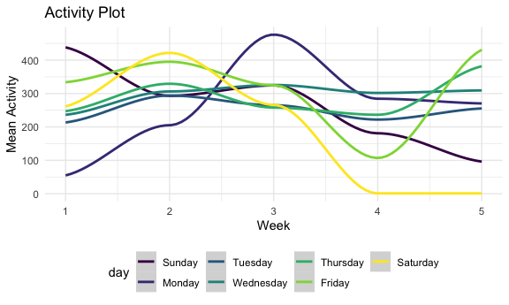
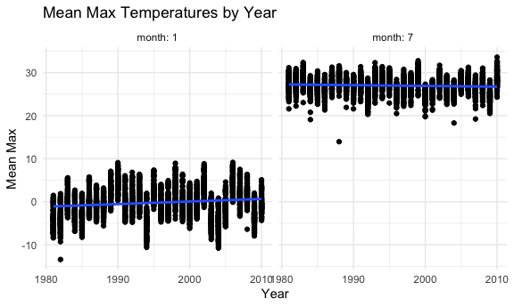
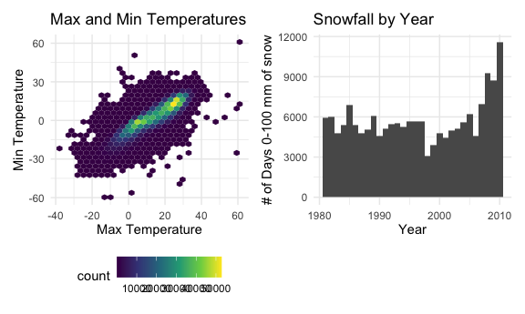

Homework 3
================

## Problem 1

``` r
data("instacart")
```

This dataset contains 1384617 rows and 15 columns.

Observations are the level of items in order by user. There are
user/order variables – user ID, order ID, order day, and order hour.
There are also item variables – name, aisle, department, and some
numeric codes. There’s also some information about the user’s past
behaviors – whether or not the customer has ordered this in the past and
days since last order.

how many aisles, and which are they from?

``` r
instacart %>% 
  count(aisle) %>% 
  arrange(desc(n))
```

    ## # A tibble: 134 x 2
    ##    aisle                              n
    ##    <chr>                          <int>
    ##  1 fresh vegetables              150609
    ##  2 fresh fruits                  150473
    ##  3 packaged vegetables fruits     78493
    ##  4 yogurt                         55240
    ##  5 packaged cheese                41699
    ##  6 water seltzer sparkling water  36617
    ##  7 milk                           32644
    ##  8 chips pretzels                 31269
    ##  9 soy lactosefree                26240
    ## 10 bread                          23635
    ## # … with 124 more rows

There are 134 aisles, and the most ordered are fresh vegetables, fresh
fruit, and packaged vegetables and fruits.

let’s make a plot

``` r
instacart %>% 
  count(aisle) %>% 
  filter(n > 10000) %>% 
  mutate(
    aisle = factor(aisle),
    aisle = fct_reorder(aisle, n)
  ) %>% 
  ggplot(aes(x = aisle, y = n)) +
  geom_point() +
  theme(axis.text.x = element_text(angle = 90, vjust = 0.5, hjust = 1))
```


making a table

``` r
instacart %>% 
  filter(aisle %in% c("baking ingredients", "dog food care", "packaged vegetables fruits")) %>% 
  group_by(aisle) %>% 
  count(product_name) %>% 
  mutate(rank = min_rank(desc(n))) %>% 
  filter(rank < 4) %>% 
  arrange(aisle, rank) %>% 
  knitr::kable()
```

| aisle                      | product\_name                                 |    n | rank |
| :------------------------- | :-------------------------------------------- | ---: | ---: |
| baking ingredients         | Light Brown Sugar                             |  499 |    1 |
| baking ingredients         | Pure Baking Soda                              |  387 |    2 |
| baking ingredients         | Cane Sugar                                    |  336 |    3 |
| dog food care              | Snack Sticks Chicken & Rice Recipe Dog Treats |   30 |    1 |
| dog food care              | Organix Chicken & Brown Rice Recipe           |   28 |    2 |
| dog food care              | Small Dog Biscuits                            |   26 |    3 |
| packaged vegetables fruits | Organic Baby Spinach                          | 9784 |    1 |
| packaged vegetables fruits | Organic Raspberries                           | 5546 |    2 |
| packaged vegetables fruits | Organic Blueberries                           | 4966 |    3 |

apples v ice cream table

``` r
instacart %>% 
  filter(product_name %in% c("Pink Lady Apples", "Coffee Ice Cream")) %>% 
  group_by(product_name, order_dow) %>% 
  summarise(mean_hour = mean(order_hour_of_day)) %>% 
  pivot_wider(
    names_from = order_dow,
    values_from = mean_hour
  )
```

    ## `summarise()` regrouping output by 'product_name' (override with `.groups` argument)

    ## # A tibble: 2 x 8
    ## # Groups:   product_name [2]
    ##   product_name       `0`   `1`   `2`   `3`   `4`   `5`   `6`
    ##   <chr>            <dbl> <dbl> <dbl> <dbl> <dbl> <dbl> <dbl>
    ## 1 Coffee Ice Cream  13.8  14.3  15.4  15.3  15.2  12.3  13.8
    ## 2 Pink Lady Apples  13.4  11.4  11.7  14.2  11.6  12.8  11.9

## Problem 2

``` r
accel_df = 
  read_csv(
    "./accel_data.csv",
    ) %>% 
  janitor::clean_names() %>%
    mutate(day = forcats::fct_relevel(day, c("Sunday", "Monday", "Tuesday", "Wednesday", "Thursday", "Friday", "Saturday"))) %>% 
  pivot_longer(
    starts_with("activity"),
    names_to = 'activity_num',
    names_prefix = "activity_",
    values_to = 'active_val'
  ) %>% 
  mutate(w_end = case_when(
     day == "Monday" ~ "weekday",
     day == "Tuesday" ~ "weekday",
     day == "Wednesday" ~ "weekday",
     day == "Thursday" ~ "weekday",
     day == "Friday" ~ "weekday",
     day == "Saturday" ~ "weekend",
     day == "Sunday" ~ "weekend",
     TRUE ~ ""
  )) %>% 
  select(-day_id) %>% 
  arrange(week, day)
```

    ## Parsed with column specification:
    ## cols(
    ##   .default = col_double(),
    ##   day = col_character()
    ## )

    ## See spec(...) for full column specifications.

This dataset contains 50400 observations of activity data over 5 weeks.
This dataset contains the variables week, day, activity\_num,
active\_val, w\_end.

``` r
accel_df = 
  read_csv(
    "./accel_data.csv",
    ) %>% 
  janitor::clean_names() %>% 
  mutate(day = forcats::fct_relevel(day, c("Sunday", "Monday", "Tuesday", "Wednesday", "Thursday", "Friday", "Saturday"))) %>% 
  pivot_longer(
    starts_with("activity"),
    names_to = 'activity_num',
    names_prefix = "activity_",
    values_to = 'active_val'
  ) %>% 
  mutate(w_end = case_when(
     day == "Monday" ~ "weekday",
     day == "Tuesday" ~ "weekday",
     day == "Wednesday" ~ "weekday",
     day == "Thursday" ~ "weekday",
     day == "Friday" ~ "weekday",
     day == "Saturday" ~ "weekend",
     day == "Sunday" ~ "weekend",
     TRUE ~ ""
  )) %>% 
  select(-day_id) %>% 
  group_by(week, day) %>% 
  summarize(
    daily_total_act = sum(active_val)
  ) %>% 
  knitr::kable()
```

    ## Parsed with column specification:
    ## cols(
    ##   .default = col_double(),
    ##   day = col_character()
    ## )

    ## See spec(...) for full column specifications.

    ## `summarise()` regrouping output by 'week' (override with `.groups` argument)

While major trends are not immediately apparent in the table, it does
appear that there is less activity on weekends.

``` r
accel_df = 
  read_csv(
    "./accel_data.csv",
    ) %>% 
  janitor::clean_names() %>% 
  mutate(day = forcats::fct_relevel(day, c("Sunday", "Monday", "Tuesday", "Wednesday", "Thursday", "Friday", "Saturday"))) %>% 
  pivot_longer(
    starts_with("activity"),
    names_to = 'active_num',
    names_prefix = "activity_",
    values_to = 'active_val'
  ) %>% 
  mutate(w_end = case_when(
     day == "Monday" ~ "weekday",
     day == "Tuesday" ~ "weekday",
     day == "Wednesday" ~ "weekday",
     day == "Thursday" ~ "weekday",
     day == "Friday" ~ "weekday",
     day == "Saturday" ~ "weekend",
     day == "Sunday" ~ "weekend",
     TRUE ~ ""
  )) %>% 
  group_by(week, day) %>% 
  summarise(active_mean = mean(active_val)) %>% 
  ggplot(aes(x = week , y = active_mean, color = day)) + 
  geom_smooth() +
   labs(
    title = "Activity Plot",
    x = "Week",
    y = "Mean Activity"
  )
```

    ## Parsed with column specification:
    ## cols(
    ##   .default = col_double(),
    ##   day = col_character()
    ## )

    ## See spec(...) for full column specifications.

    ## `summarise()` regrouping output by 'week' (override with `.groups` argument)

``` r
accel_df
```

    ## `geom_smooth()` using method = 'loess' and formula 'y ~ x'



Based on this graph, it appears that weekend activity starts around the
same level as weekday activity, but decreases significantly by week 3.

## Problem 3

``` r
data("ny_noaa")
```

This dataset contains the variables id, date, prcp, snow, snwd, tmax,
tmin. The dataset has 2595176 rows and 7 columns. The variable “prcp”
refers to precipitation in tenths of millimeters; “snow” refers to
snowfall in millimeters; and snwd refers to snow depth in millimeters.

``` r
ny_noaa %>% 
  separate(date, into = c("year", "month", "day"), convert = TRUE) %>% 
  mutate(
    tmax = as.numeric(tmax)/100,
    tmin = as.numeric(tmin)/100
  ) %>% 
  group_by(snow) %>% 
  count(snow) %>% 
  arrange(desc(n))
```

    ## # A tibble: 282 x 2
    ## # Groups:   snow [282]
    ##     snow       n
    ##    <int>   <int>
    ##  1     0 2008508
    ##  2    NA  381221
    ##  3    25   31022
    ##  4    13   23095
    ##  5    51   18274
    ##  6    76   10173
    ##  7     8    9962
    ##  8     5    9748
    ##  9    38    9197
    ## 10     3    8790
    ## # … with 272 more rows

For snowfall, the most commonly seen values by far are 0 and NA. This is
because there are many days without snowfall in NY, and because there is
a lot of missing data in this dataset.

``` r
ny_noaa %>% 
  separate(date, into = c("year", "month", "day"), convert = TRUE) %>% 
   filter(month == 1 | month == 7) %>% 
  mutate(
    tmax = as.numeric(tmax)/10,
    tmin = as.numeric(tmin)/10
  ) %>% 
  group_by(id, year, month) %>% 
  summarize(tmax_mean = tmax) %>% 
  drop_na(tmax_mean) %>% 
  ggplot(aes(x = year, y = tmax_mean)) + 
  geom_point() +
  geom_smooth(method = "lm", se = FALSE) + 
  facet_grid(. ~ month,
             labeller = label_both) +
  theme(legend.position = "none") +
  labs(
    title = "Mean Max Temperatures by Year",
    x = "Year",
    y = "Mean Max"
  )
```

    ## `summarise()` regrouping output by 'id', 'year', 'month' (override with `.groups` argument)

    ## `geom_smooth()` using formula 'y ~ x'



While there are occasional outlier years, max January temperatures
appear to be increasing as the years progress. July temperatures appear
to have remained constant.

``` r
tmax_tmin_p = 
  ny_noaa %>% 
  separate(date, into = c("year", "month", "day"), convert = TRUE) %>% 
  mutate(
    tmax = as.numeric(tmax)/10,
    tmin = as.numeric(tmin)/10
  ) %>% 
  drop_na(tmin) %>% 
  drop_na(tmax) %>% 
  ggplot(aes(x = tmax, y = tmin, size = tmax)) +
  geom_hex() +
  labs(
   title = "Max and Min Temperatures",
    x = "Max Temperature",
    y = "Min Temperature"
  )

snowfall_p = 
  ny_noaa %>% 
  separate(date, into = c("year", "month", "day"), convert = TRUE) %>% 
  drop_na(snow) %>% 
  filter(snow > 0 & snow < 100) %>% 
  ggplot(aes(x = year, fill = )) + 
  geom_histogram() +
  labs(
    title = "Snowfall by Year",
    x = "Year",
    y = "# of Days 0-100 mm of snow"
  )

tmax_tmin_p + snowfall_p
```

    ## `stat_bin()` using `bins = 30`. Pick better value with `binwidth`.


